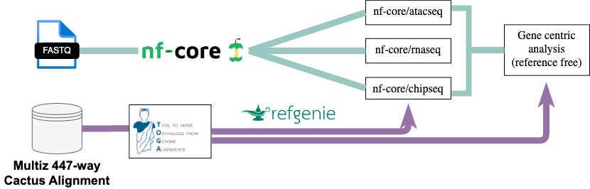

# Comparative Multiomics preprocessing Workflow

## Overview 


This repository contains scripts to process high throughput sequencing data from different molecular assays using standardized nf-core pipelines and refgenie to manage the high number of genomes and annotations. TOGA genome annotations are either downloaded from ... or generated from scratch using TOGA.


## BasicQC pipeline
This section describes the initial quality control (QC) steps for raw sequencing data.  

- **Input**: cnag sample info  
- **Tools**: [FastQC](https://www.bioinformatics.babraham.ac.uk/projects/fastqc/), [FastQ Screen](https://www.bioinformatics.babraham.ac.uk/projects/fastq_screen/), [kraken2](https://ccb.jhu.edu/software/kraken2/)  
- **Output**: Multi QC reports (HTML/summary tables)  

**Usage example:**
```bash
### activate the conda environment
conda activate basicQC
```
To run the frist part of the pipeline:

```bash
## run QC version 1.3
bash runQC_1.3.sh </raw/data/path/> <cnag_project> </result/path/>
bash runQC_1.3.sh /scratch_isilon/groups/compgen/data_transfer CGLZOO_01 RNA-seq /scratch_isilon/groups/compgen/data/Illumina_CryoZoo/BasicQC

```
to run MultiQC

```bash
conda activate multiQC

sbatch runMultiQC.sh </result/path/cnag_project/>
sbatch runMultiQC.sh /scratch_isilon/groups/compgen/data/Illumina_CryoZoo/BasicQC/CGLZOO_01
```
For more information [BasicQC pipeline](BasicQC/README.md)  


## ATAC-seq
Pipeline for ATAC-seq processing and analysis.  

- **Steps**: alignment → filtering → peak calling → QC (TSS enrichment, FRiP, duplication rates) → downstream analysis.  
- **Key tools**: e.g. BWA, Picard, MACS2, ArchR.  
- **Outputs**: fragment files, peak calls, QC plots.  

**Usage example:**
```bash
nextflow run atacseq.nf --genome hg38 --reads "data/atac/*.fastq.gz"
```

---

## RNA-seq
Pipeline for RNA-seq processing and analysis.  

- **Steps**: trimming → alignment/quantification → QC → differential expression analysis.  
- **Key tools**: e.g. STAR, Salmon, DESeq2.  
- **Outputs**: gene count matrices, QC reports, differential expression tables.  

**Usage example:**
```bash
nextflow run rnaseq.nf --genome hg38 --reads "data/rna/*.fastq.gz"
```

---

## Genomes
This repository uses [refgenie](http://refgenie.databio.org/) to manage genome references.  

The available genomes are listed below and updated automatically:  

<!-- GENOMES_START -->
### Available Genomes
```
                              Local refgenie assets                               
               Server subscriptions: http://refgenomes.databio.org                
┏━━━━━━━━━━━━━━━━━━━━━━━━━━━━━━━━┳━━━━━━━━━━━━━━━━━━━━━━━━━━━━━━━━━━━━━━━━━━━━━━━┓
┃ genome                         ┃ assets                                        ┃
┡━━━━━━━━━━━━━━━━━━━━━━━━━━━━━━━━╇━━━━━━━━━━━━━━━━━━━━━━━━━━━━━━━━━━━━━━━━━━━━━━━┩
│ hg38                           │ fasta, gencode_gtf                            │
│ mm10                           │ fasta, gencode_gtf                            │
│ EBV                            │ fasta                                         │
│ Pan_troglodytes_T2Tv2          │ fasta, bowtie2_index, star_index, gencode_gtf │
│ GorGor1                        │ fasta, bowtie2_index                          │
│ ercc                           │ fasta, bowtie2_index                          │
│ Bos_taurus                     │ fasta, bowtie2_index, star_index, gencode_gtf │
│ Callithrix_jacchus             │ fasta, bowtie2_index, star_index, gencode_gtf │
│ Gallus_gallus                  │ fasta, bowtie2_index, star_index              │
│ Notamacropus_eugeni            │ fasta, bowtie2_index                          │
│ Anolis_carolinensis            │ fasta, bowtie2_index, star_index, gencode_gtf │
│ Panthera_leo                   │ fasta, bowtie2_index, star_index, gencode_gtf │
│ Caretta_caretta                │ fasta, bowtie2_index, star_index              │
│ Bombina_bombina                │ fasta, bowtie2_index                          │
│ Loxodonta_africana             │ fasta, bowtie2_index, star_index, gencode_gtf │
│ Equus_caballus                 │ fasta, star_index, bowtie2_index, gencode_gtf │
│ Canis_lupus                    │ fasta, bowtie2_index, star_index              │
│ Pongo_pygmaeus_T2Tv2           │ fasta, gencode_gtf                            │
│ Panthera_tigris_TOGA           │ fasta, toga_gtf, star_index                   │
│ Lutra_lutra_TOGA               │ fasta, toga_gtf, star_index                   │
│ Mustela_putorius_TOGA          │ fasta, toga_gtf, star_index                   │
│ Equus_caballus_TOGA            │ fasta, star_index, toga_gtf                   │
│ Bos_grunniens_TOGA             │ fasta, toga_gtf, star_index                   │
│ Muntiacus_reevesi_TOGA         │ fasta, toga_gtf, star_index                   │
│ Callithrix_jacchus_TOGA        │ fasta, toga_gtf, star_index                   │
│ Panthera_leo_TOGA              │ fasta, toga_gtf, star_index                   │
│ Papio_anubis_TOGA              │ fasta, toga_gtf, star_index                   │
│ Oryctolagus_cuniculus_TOGA     │ fasta, toga_gtf, star_index                   │
│ Hydrochoerus_hydrochaeris_TOGA │ fasta, toga_gtf, star_index                   │
│ Zalophus_californianus_TOGA    │ fasta, toga_gtf, star_index                   │
│ Hippopotamus_amphibius_TOGA    │ fasta, toga_gtf, star_index                   │
│ Procavia_capensis_TOGA         │ fasta, star_index, toga_gtf                   │
│ Dolichotis_patagonum_TOGA      │ fasta, toga_gtf, star_index                   │
│ Pan_troglodytes_TOGA           │ fasta, toga_gtf, star_index                   │
│ Pongo_pygmaeus_TOGA            │ fasta, toga_gtf, star_index                   │
│ Loxodonta_africana_TOGA        │ fasta, toga_gtf, star_index                   │
│ Gorilla_gorilla_TOGA           │ fasta, toga_gtf, star_index                   │
│ Equus_quagga_TOGA              │ fasta, toga_gtf, star_index                   │
│ Hystrix_cristata_TOGA          │ fasta, toga_gtf, star_index                   │
│ Macaca_mullatta_RheMac10       │ fasta, gencode_gtf                            │
│ Gorilla_gorilla_T2Tv2          │ fasta, gencode_gtf                            │
│ Pongo_abelii_T2Tv2             │ fasta, gencode_gtf                            │
└────────────────────────────────┴───────────────────────────────────────────────┘
               use refgenie list -g <genome> for more detailed view               
```


## Dependencies / Installation
To run the pipelines in this repository, install the following dependencies.  

### Conda 

Different dependencies require different conda environments specified in the subrepos


### Nextflow
Install Nextflow:
```bash
curl -s https://get.nextflow.io | bash
mv nextflow ~/bin/  # or another directory in your PATH
```

### Optional tools
- Java 11+ (required by Nextflow)  
- refgenie (for genome management):
- Other pipeline-specific tools may be installed via conda or system package manager.

---